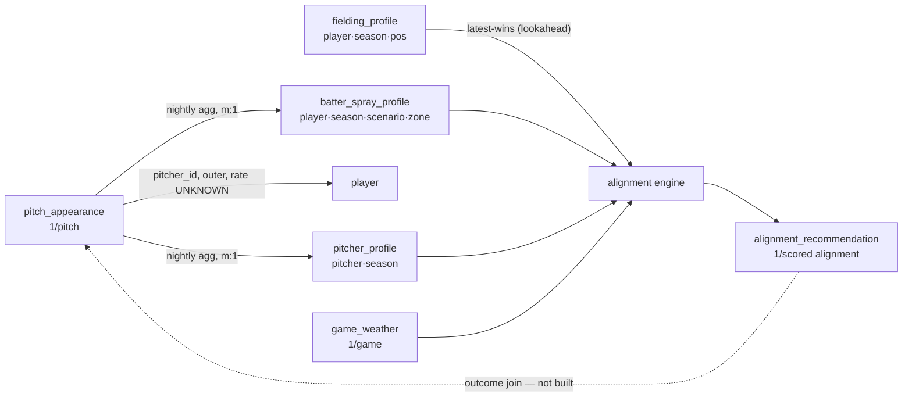

# Data Map

> **TL;DR** (refresh this line whenever the file changes): Seed map from the 2026-09-03 /ds-integrate reconcile — all edges are drawn from code reading (DATA_KNOWLEDGE.md), **no empirical match-rate counts have been run yet** (`/ds-connect` pending). The weakest edge — the `hc_x/hc_y → grid` transform — was **calibrated 2026-09-04 and found materially wrong** (2.29 ft/unit not 2.0, era drift; ball frame ~13% compressed vs fielder frame). Coordinated frame rebuild is the top roadmap item; see DATA_KNOWLEDGE.md.

> Project-specific connection map: how the datasets join, at what grain, under what temporal rules, and what each joined grain can answer. Maintained by `/ds-connect`. Edges are validated by counting, never by model performance. Label claims: VERIFIED / INFERRED / ASSUMED / HYPOTHESIS / UNKNOWN.

## Nodes (datasets)

| Dataset | Grain (how verified) | Keys (uniqueness tested?) | Time column / coverage | Rows |
|---|---|---|---|---|
| `pitch_appearance` | 1 row/pitch [VERIFIED — code] | `mlb_play_id` dedupe key, idempotent re-ingest [VERIFIED] | game date; 2016–2025 | ~700–750k/season [INFERRED] |
| `batter_spray_profile` | 1 row/(player, season, scenario, fielding_zone) [VERIFIED] | rebuilt DELETE+insert per season; uniqueness by construction [VERIFIED] | season | UNKNOWN (not counted) |
| `fielding_profile` | 1 row/(player, season, position) [VERIFIED] | not uniqueness-tested | season; weekly sync current season | UNKNOWN |
| `pitcher_profile` | 1 row/(pitcher, season) [VERIFIED] | built nightly like spray | season | UNKNOWN |
| `player` | 1 row/player (roster) [ASSUMED] | `player_id` | — | UNKNOWN |
| `game_weather` | 1 row/game (`game_id`), Open-Meteo [VERIFIED — docs] | `game_id` | game date | UNKNOWN |
| `alignment_recommendation` | 1 row/scored alignment [VERIFIED] | best-effort writes (may drop rows) | request time | UNKNOWN |
| `player_injury` | active/historical injuries per player [VERIFIED] | — | injury dates | UNKNOWN |

## Edges (joins)

### `pitch_appearance` ↔ `player` (pitcher hand) — CONDITIONAL

- **Key(s)**: `pitcher_id` → `player.player_id` (for `throws`), outer join in spray aggregation
- **Cardinality** (expected vs observed): m:1 expected; not counted
- **Match rate** (A→B / B→A): UNKNOWN — pitchers missing a player row silently lose the hand scenario [VERIFIED — code behavior; magnitude uncounted]
- **Unmatched pattern**: UNKNOWN (plausibly systematic — call-ups/older seasons)
- **Temporal rule**: none (handedness treated as static)
- **Information loss**: unmatched pitches fall out of hand-scenario aggregates only; "all" aggregate unaffected
- **Evidence**: [INFERRED — code reading 2026-09-02; counts not run]

### `pitch_appearance` → `batter_spray_profile` / `pitcher_profile` — TRUSTED (derivation, not a join)

- Nightly aggregations of the fact table; grain change m:1 by construction. Per-scenario spray rows require ≥10 batted balls (`MIN_COMBO_SAMPLE`); zones with `total=0` produce no row. [VERIFIED]
- **Temporal rule / hazard**: a season-S aggregate contains all of season S → within-season retrospective use leaks outcomes. [INFERRED — DATA_KNOWLEDGE.md]

### serve-time scenario ↔ `fielding_profile` — CONDITIONAL

- **Key(s)**: fielder `player_id`, via `get_latest_profile` (newest profile wins)
- **Temporal rule**: point-in-time hazard — latest profile is **future data** for any historical scenario; fine for live pre-pitch use. [INFERRED]
- **Information loss**: null attributes fall back to engine defaults (speed 27 ft/s, rt 0.4, route 85%). [VERIFIED]

### serve-time scenario ↔ `game_weather` / `WeatherInput` — TRUSTED (mechanical)

- **Key(s)**: `game_id`, or transient user-supplied override; no historical join used analytically. Carry/drift factors themselves are the user's least-trusted component (see DATA_KNOWLEDGE.md / ROADMAP P3).

### `alignment_recommendation` ↔ realized outcomes — UNKNOWN (not built)

- The only place model outputs are logged with full scenario; joining to realized play results would enable outcome-linked evaluation of served recommendations. Candidate key path: scenario timestamp/game/batter → `pitch_appearance`. Untested. [INFERRED — flagged in DATA_KNOWLEDGE.md]

## Diagram

## Answerable grains

- **(batter, season, scenario, zone)** — spray-based positioning inputs; 8 zones only, so fine x,y placement questions are NOT answerable at this grain (known data gap).
- **(pitch/batted ball)** — the outcome-eval grain used for calibration and the LOSO reliability gate (884k standard-alignment balls). [VERIFIED — EXPERIMENTS.md]
- **(served recommendation → realized outcome)** — NOT yet answerable; requires the unbuilt `alignment_recommendation` outcome join above.

## Rejected paths (with reasons — durable knowledge)

- None recorded yet.
